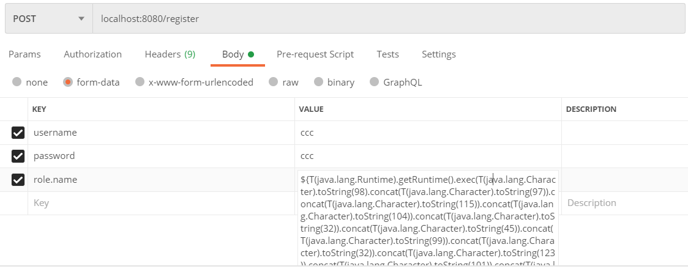
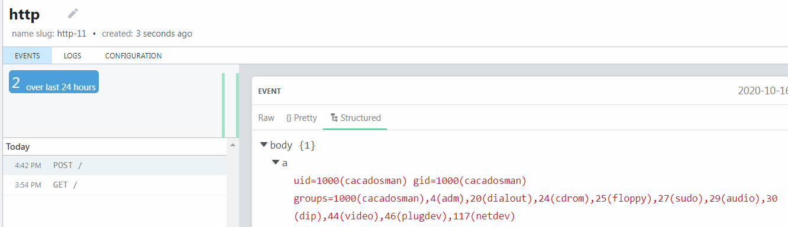

## Judul Soal
Pesugihan Online

## Deskripsi Soal
> Tolong saya ditipu oleh website abal-abal yang katanya ahli pesugihan yang ternyata dia petapa palsu, tolong webnya dihack aja :'(  Author: cacadosman

---

## Penjelasan Singkat Soal
Soal ini berisikan sebuah web service yang dibuat menggunakan framework Spring Boot.  
Nah, intinya di sini terdapat dua vuln.   

Pertama, vuln nya ada di bagian registrasi yang dimana `request body` nya langsung menggunakan `User` model dan langsung disave,
sehingga saat melakukan registrasi, field pada model `User` bisa dengan mudah dimanipulasi. Pada kasus ini, field `role` yang dimanipulasi untuk dimasukkan sebuah `payload`.  

Kedua, vuln nya yaitu manipulasi view thymeleaf saat melakukan `parsing template name` yang dimana thymeleaf melakukan
parsing template name sebagai `expression` yang dimana kita bisa melakukan injeksi `Spring Expression Language (SPeL)` untuk 
mendapatkan akses `shell (RCE)`  

Jadi, saat user akan mengakses dashboard, backendnya akan memparsing template name beserta `fragment` yang dimana fragmentnya itu berdasarkan dari `role` user, nah bagian role ini lah yang dimasukkan payload dengan menggunakan cara pada vuln pertama. 
Kemudian payload akan diparsing dan akhirnya dapat melakukan `Remote Code Execution (RCE)`
  

Lalu, terdapat sebuah filter yang melakukan html escape untuk meningkatkan kesulitan soal, sehingga peserta diharuskan 
untuk memutar otak untuk dapat membypass filterya. 

## Catatan Deploy Soal
- File `pesugihan-online.zip` diberikan kepada peserta
- Folder deploy soal di server terdapat pada folder `server`
- Ubah port yang diinginkan untuk service soal pada file `docker-compose.yml`
- run `docker-compose build`
- Lalu tinggal `docker-compose up -d`

## Catatan Solver
Solver soal terdapat pada script python2 bernama `payload_generator.py` pada folder `solver` . Tinggal mengganti payloadnya saja sesuai keinginan (misal mau melakukan reverse shell atau terserah intinya RCE). 
Cara eksploitasi saat melakukan registrasi, inject `payload` pada form data `role.name` (bisa dengan postman).  
 
*POC Postman Request*

  
*POC RCE Success*

 